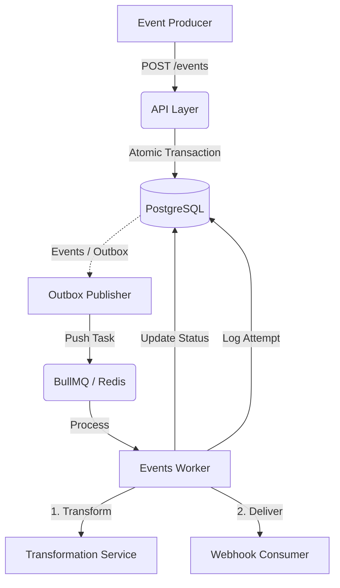
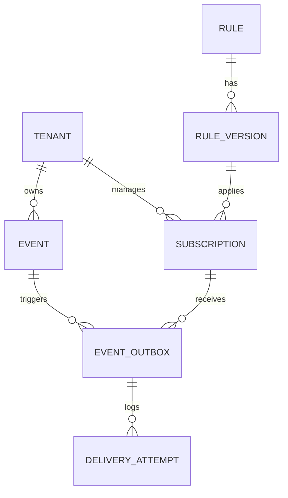
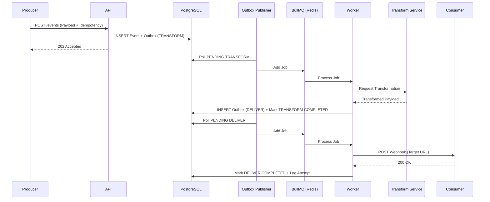

# Event Orchestrator

A high-performance, production-grade event orchestration and delivery platform designed for reliable webhook distribution, complex event transformation, and multi-tenant isolation.

> [!IMPORTANT]
> This service requires the **[Delivero Transformer Service](https://github.com/sarthakdixit2003/delivero-transformer-service)** to handle payload transformations. Ensure both services are running for full functionality.

## Overview

The Event Orchestrator acts as a central hub for ingesting, processing, and delivering events across a distributed ecosystem. It ensures at-least-once delivery guarantees through the **Transactional Outbox Pattern**, supports dynamic payload transformation using versioned rules, and provides granular flow control via per-subscription rate limiting and concurrency management.

Built with a focus on reliability and scalability, the system handles the entire event lifecycle—from initial ingestion and idempotency checks to transformation coordination and secure webhook delivery.

---

## Core Features

- **Transactional Ingestion:** Guarantees that an event is only accepted if its corresponding outbox tasks are successfully persisted.
- **Dynamic Transformation:** Decouples event sources from consumers using versioned JSON-based transformation templates.
- **Reliable Webhook Delivery:** Implements exponential backoff, per-attempt logging, and Dead Letter Queue (DLQ) support.
- **Advanced Flow Control:** Per-subscription concurrency limits and rate limiting (RPS) backed by Redis.
- **Multi-Tenant Architecture:** Strong isolation via `tenant_id` validation and scoped resource management.
- **Security & Integrity:** Supports HMAC signatures for payload verification and header-based idempotency.
- **Observability:** Comprehensive delivery attempt logs capturing request/response headers, bodies, and latency metrics.

---

## High-Level Architecture

The system follows a decoupled architecture using a combination of SQL-based outbox tables and Redis-backed task queues.



---

## End-to-End Event Lifecycle

1.  **Ingestion:** Event received via API with a `tenant_id` and `idempotency_key`.
2.  **Persistence:** The system atomically records the event and creates `TRANSFORM` tasks for all matching enabled subscriptions in the `event_outbox`.
3.  **Outbox Polling:** The `Outbox Publisher` scans for pending tasks and moves them into the BullMQ processing queue.
4.  **Transformation:** The worker invokes the transformation engine to map the `original_payload` to the consumer-specific format.
5.  **Delivery Transition:** Upon successful transformation, a `DELIVER` task is created in the outbox.
6.  **Reliable Delivery:** The worker executes the delivery, respecting concurrency and rate limits. If it fails, it retries with exponential backoff.
7.  **Finalization:** Successful delivery marks the task as `COMPLETED`. Exhausted retries move the task to `DLQ`.

---

## System Design Decisions

### 1. Transactional Outbox Pattern
**Why:** To avoid the "dual write" problem. By saving both the event and the delivery task in a single database transaction, we guarantee that we never lose an event that we've acknowledged to the producer.

### 2. Decoupled Outbox Publisher
**Why:** Polling the database for pending tasks ensures that even if the BullMQ/Redis layer is temporarily unavailable, tasks remain safe in PostgreSQL and will be queued as soon as connectivity is restored.

### 3. Redis-Backed Concurrency & Rate Limiting
**Why:** Implementing these at the application level in a distributed environment requires a shared state. Redis provides the necessary atomic operations (`INCR`, `EXPIRE`) to enforce limits across multiple worker instances.

### 4. Versioned Transformation Rules
**Why:** Allows for zero-downtime updates to event schemas. Consumers can migrate to new formats at their own pace by updating their subscription to a new rule version.

---

## Folder Structure

```text
src/
├── config/             # Environment & global configurations
├── db-utils/           # PostgreSQL pool & connection management
├── errors/             # Standardized domain-specific error classes
├── logger/             # Pino-based structured logging
├── middleware/         # Auth, Rate Limiting, Caching, Error handling
├── modules/
│   ├── events/         # Ingestion logic & Idempotency management
│   ├── queue/          # BullMQ queue definitions
│   ├── rules/          # Transformation rule & versioning models
│   ├── subscription/   # Webhook target configurations
│   ├── tenants/        # Multi-tenancy & isolation logic
│   └── workers/        # Background processing (Publisher, Worker, Handlers)
├── redis/              # Redis client & cache configurations
└── utils/              # Common validation & utility functions
```

---

## Core Modules Explained

- **Events Module:** Manages the entry point for all incoming data. It validates `tenant_id` and ensures strict idempotency using a dedicated `idempotency_key` table.
- **Workers Module:** Contains the `Outbox Publisher` (poller) and the `Events Worker` (BullMQ consumer). Handlers for `TRANSFORM` and `DELIVER` tasks are isolated here to keep processing logic modular.
- **Rules Module:** Handles the definition and versioning of transformation rules. It allows the system to map a single source event to multiple different target schemas.
- **Subscription Module:** Stores configuration for delivery targets, including endpoint URLs, authentication secrets, and flow control parameters (RPS, concurrency).

---

## Database Design

The system uses PostgreSQL as its primary source of truth, leveraging the **Transactional Outbox Pattern** to ensure data consistency between event ingestion and delivery.

- **Storage:** Uses `JSONB` for flexible event payloads and transformation templates.
- **Reliability:** Enforces strict foreign key constraints and unique indexes for idempotency.
- **Auditability:** Maintains a `delivery_attempt` log for every single webhook execution.

For a comprehensive breakdown of tables, enums, and indexes, refer to the [Database Schema Documentation](./database-schema.md).

### Core Schema Relationships



### Key Data Structures

| Entity | Description |
| :--- | :--- |
| **Outbox** | High-concurrency state machine for `TRANSFORM` and `DELIVER` tasks. |
| **Idempotency** | Tenant-scoped keys to prevent duplicate event ingestion. |
| **Rule Versions** | Versioned DSL templates for payload mapping. |
| **Attempts** | Rich execution logs including request/response headers and bodies. |

---

## Event Pipeline Flow



---

## Delivery & Retry Mechanism

The system employs a multi-tiered retry strategy:
1.  **Queue-Level Retries:** BullMQ handles immediate retries with exponential backoff (`delay * 2^attempt`).
2.  **Outbox Persistence:** If a worker crashes, the `Outbox Publisher` will eventually find the task in an incomplete state (`QUEUED` or `PROCESSING` but stale) and re-queue it.
3.  **Dead Letter Queue (DLQ):** Once `max_retries_allowed` (defined per subscription) is exceeded, a new outbox entry with `task_type = 'DLQ'` is created. This entry maintains a `source_outbox_id` link to the original failed task, preserving the entire failure context for manual recovery or replay.

---

## Multi-Tenancy Model

- **Authentication:** Every API request must include an `X-Tenant-Id` header.
- **Middleware:** `tenantAuthMiddleware` validates the tenant exists in the database and injects the `tenant_id` into the request context.
- **Data Isolation:** All queries for events, subscriptions, and rules are scoped by `tenant_id` to ensure no cross-tenant data leakage.

---

## Caching & Rate Limiting

### Caching Strategy
- **Tenant & Subscription Metadata:** Cached in Redis to reduce database load during high-frequency event ingestion and processing.
- **Middleware:** `cacheMiddleware` handles response caching for frequently accessed configuration endpoints.

### Rate Limiting Strategy
- **Ingestion:** Global rate limiting via `rateLimiterMiddleware` prevents API abuse.
- **Egress (Delivery):** Per-subscription rate limiting (RPS) and concurrency limits are enforced via Redis atomic counters to protect consumer endpoints from being overwhelmed.

---

## Transformation System

The system delegates payload mapping to the **[Delivero Transformer Service](https://github.com/sarthakdixit2003/delivero-transformer-service)** via the `TRANSFORM_API_BASE_URL`.

- **Schema Validation:** The `rule_version` includes a JSON schema to validate the `original_payload`.
- **Template Mapping:** Uses the `transform_template` to convert the source data into the consumer's required format.
- **Versioning:** Subscriptions are tied to a specific `rule_id`. The worker always fetches the latest `version_number` for that rule during the `TRANSFORM` stage.

---

## Idempotency Strategy

1.  **Ingestion Idempotency:** The API checks the `idempotency_key` table before accepting an event. If a duplicate is found for the same tenant, it returns the existing event record without re-processing.
2.  **Delivery Idempotency:** The system propagates the `X-Idempotency-Key` in the webhook headers, allowing the consumer to deduplicate delivery attempts if a retry occurs due to network timeouts.

---

## Local Development Setup

### Prerequisites
- Node.js (v20+)
- PostgreSQL (v15+)
- Redis (v7+)

### Installation

1. Clone the repository and install dependencies:
   ```bash
   npm install
   ```

2. Configure environment variables (see `.env.example`):
   ```bash
   cp .env.example .env
   ```

3. Start supporting services via Docker:
   ```bash
   docker-compose up -d
   ```

4. Run the API service:
   ```bash
   npm run dev
   ```

5. Start the background worker (in a separate terminal):
   ```bash
   npm run worker
   ```

---

## Environment Variables

| Variable | Description | Default |
| :--- | :--- | :--- |
| `PORT` | API Service Port | `3000` |
| `DB_HOST` | PostgreSQL Host | `localhost` |
| `DB_PORT` | PostgreSQL Port | `5432` |
| `REDIS_HOST` | Redis Host | `localhost` |
| `REDIS_PORT` | Redis Port | `6379` |
| `TRANSFORM_API_BASE_URL` | Base URL for the transformation service | - |

---

## API Overview

### Example Ingestion Request
```bash
curl -X POST http://localhost:3000/api/v1/events \
  -H "X-Tenant-Id: your-tenant-id" \
  -H "Content-Type: application/json" \
  -d '{
    "event_type": "order.created",
    "source": "checkout-service",
    "idempotency_key": "unique-request-id",
    "original_payload": { "order_id": 123, "amount": 99.99 }
  }'
```

### Example Response
```json
{
  "id": "evt_01J2...",
  "status": "NOT_STARTED",
  "received_at": "2026-05-19T..."
}
```

---

## Tech Stack

- **Runtime:** Node.js (TypeScript)
- **Framework:** Express
- **Database:** PostgreSQL (Primary persistence)
- **Caching/Queue:** Redis & BullMQ
- **Logging:** Pino (Structured JSON logging)
- **HTTP Client:** Axios (For transformation and delivery)

---

## Future Improvements

- **Bulk Ingestion:** API support for batch event submission.
- **Circuit Breaker:** Implement circuit breakers for consumer endpoints that are consistently failing.
- **Replay API:** Allow tenants to trigger a manual replay of events from the DLQ.
- **Dashboard:** A UI for monitoring event flow, delivery success rates, and subscription health.
