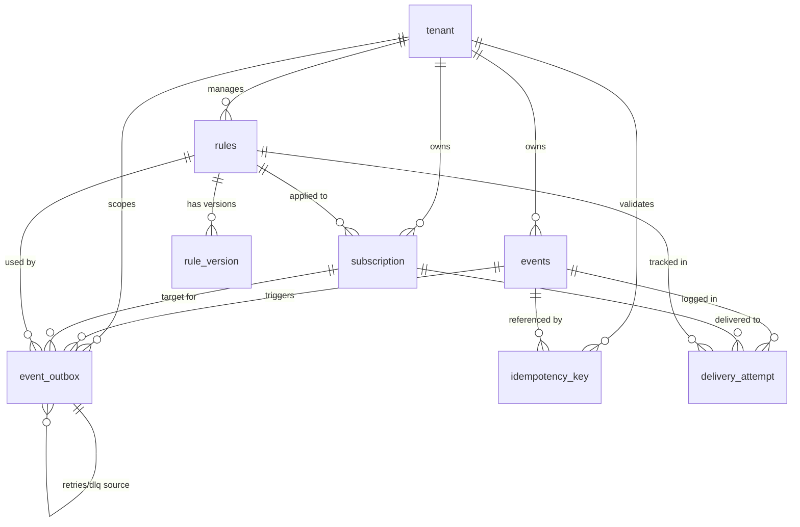

# Database Schema Documentation

This document provides a detailed overview of the PostgreSQL database schema for the Event Orchestrator.

## Entity Relationship Diagram

## Custom Enums

### `AUTH_TYPE_ENUM`
Used in the `subscription` table to define the authentication method for outgoing webhooks.
- `hmac`: Hash-based Message Authentication Code.
- `bearer`: Bearer token authentication.

### `EVENT_STATUS_ENUM`
Tracks the high-level state of an event from ingestion to final delivery.
- `NOT_STARTED`, `QUEUED`, `IN_PROGRESS`, `DELIVERED`, `FAILED`, `DLQ`.

### `OUTBOX_TASK_TYPE_ENUM`
Defines the type of task recorded in the transactional outbox.
- `TRANSFORM`: Payload transformation task.
- `DELIVER`: Webhook delivery task.
- `DLQ`: Dead Letter Queue entry.

### `OUTBOX_STATUS_ENUM`
Tracks the lifecycle of an individual outbox task.
- `PENDING`, `QUEUED`, `PROCESSING`, `COMPLETED`, `FAILED`.

---

## Tables

### `tenant`
The root entity for multi-tenant isolation.
| Column | Type | Constraints | Description |
| :--- | :--- | :--- | :--- |
| `id` | UUID | PRIMARY KEY | Generated using `uuidv7()`. |
| `name` | VARCHAR(100) | UNIQUE | Tenant name. |
| `enabled` | BOOLEAN | DEFAULT true | Global toggle for tenant activity. |
| `created_at` | TIMESTAMPTZ | DEFAULT NOW() | |
| `updated_at` | TIMESTAMPTZ | DEFAULT NOW() | |
| `deleted_at` | TIMESTAMPTZ | | Soft delete timestamp. |

### `subscription`
Configuration for event consumers/webhooks.
| Column | Type | Constraints | Description |
| :--- | :--- | :--- | :--- |
| `id` | UUID | PRIMARY KEY | |
| `tenant_id` | UUID | FK (tenant.id) | Scopes the subscription. |
| `rule_id` | INT | FK (rules.id) | Optional transformation rule. |
| `name` | VARCHAR(100) | | Unique per tenant. |
| `endpoint_url` | TEXT | | Target webhook URL. |
| `auth_type` | AUTH_TYPE_ENUM | | |
| `auth_secret_ref` | TEXT | | Key or secret for auth. |
| `max_retries_allowed`| INT | DEFAULT 3 | |
| `concurrency_limit` | INT | DEFAULT 1 | Redis-backed limit. |
| `rate_limit_rps` | INT | DEFAULT 0 | 0 means no limit. |

### `events`
Immutable record of all ingested events.
| Column | Type | Constraints | Description |
| :--- | :--- | :--- | :--- |
| `id` | UUID | PRIMARY KEY | |
| `tenant_id` | UUID | FK (tenant.id) | |
| `event_type` | VARCHAR(100) | | e.g., `order.created`. |
| `source` | VARCHAR(100) | | Originating system. |
| `original_payload` | JSONB | | Raw input data. |
| `status` | EVENT_STATUS_ENUM | | |
| `idempotency_key` | VARCHAR(100) | UNIQUE (tenant, key) | Prevents duplicates. |

### `rules` & `rule_version`
Management for payload transformation logic.
- **`rules`**: Metadata for a transformation rule set.
- **`rule_version`**: The actual DSL/Schema versions. Uses a unique constraint on `(rule_id, version_number)`.

### `event_outbox`
The core of the reliable delivery engine (Transactional Outbox).
| Column | Type | Constraints | Description |
| :--- | :--- | :--- | :--- |
| `id` | UUID | PRIMARY KEY | |
| `event_id` | UUID | FK (events.id) | |
| `task_type` | OUTBOX_TASK_TYPE_ENUM | | `TRANSFORM` or `DELIVER`. |
| `status` | OUTBOX_STATUS_ENUM | | Current task state. |
| `scheduled_at` | TIMESTAMPTZ | DEFAULT NOW() | When the task is eligible for picking. |
| `retry_count` | INT | DEFAULT 0 | |
| `source_outbox_id` | UUID | FK (self.id) | Links retries or DLQ to original. |

### `delivery_attempt`
Comprehensive audit log for every execution attempt.
Contains full request/response snapshots (`headers`, `body`, `response_code`) and latency metrics (`started_at`, `finished_at`).

---

## Indexes & Optimization

### Functional/Partial Indexes
- **`idx_subscription_tenant_enabled`**: Optimized for fetching active subscriptions for a tenant.
  - `(tenant_id, enabled) WHERE deleted_at IS NULL`
- **`idx_task_type_scheduled_at`**: Optimized for the Outbox Publisher polling.
  - `(task_type, scheduled_at) WHERE status = 'PENDING'`

### Composite Indexes
- **`idx_rule_id_version`**: Optimized for fetching the latest version of a rule.
  - `(rule_id, version_number DESC)`
- **`UQ_TENANT_IDEMPOTENCY_KEY`**: Enforces ingestion idempotency at the database level.
